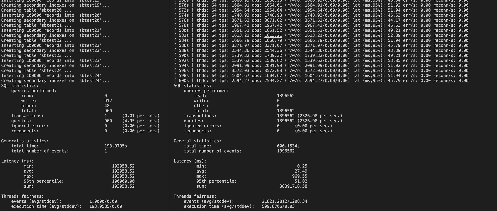

# sql-proxy-logger
TCP прокси-сервер для СУБД Postgresql с логированием Query. SSL не поддерживается. 
Для запуска программы необходимо указать используемый порт, адрес субд, порт субд.
./proxy_logger <порт> <адрес субд> <порт субд>
# результат тестированяи при большом количестве клиентов - sysbench.

